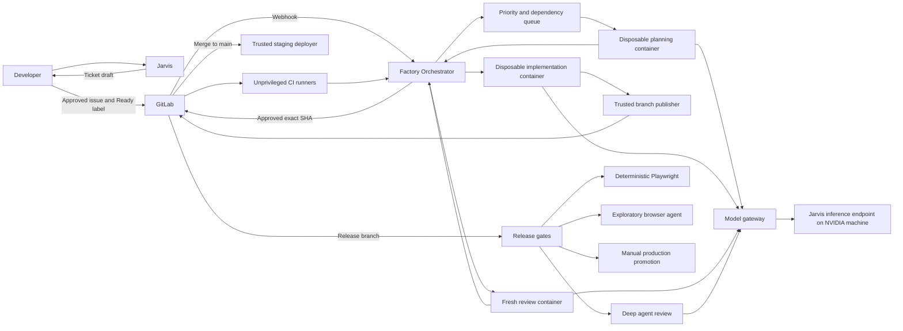
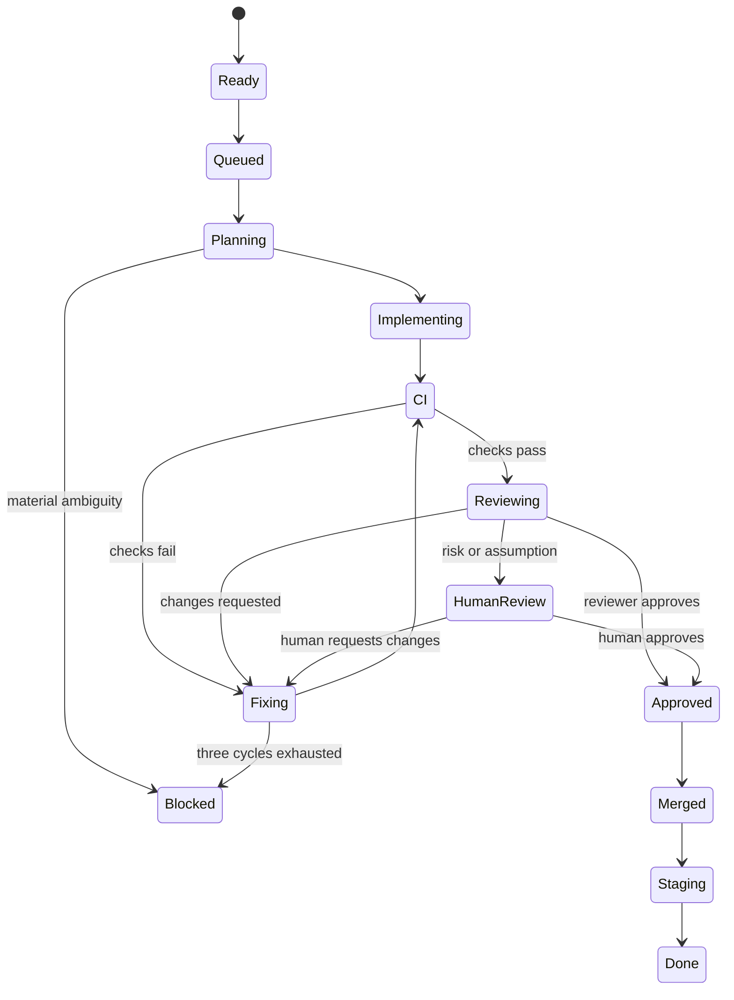

# Local Agentic Software Factory Plan

**Status:** Proposed

## Decision

Build a local-first, single-developer software factory around self-managed GitLab, disposable agent containers, and the existing Jarvis inference endpoint on the NVIDIA machine.

V1 uses Jarvis as its only physical LLM provider. Interactive Jarvis and every autonomous factory role route through LiteLLM; logical aliases exist for role policy, accounting, and future expansion, not to select different V1 providers. Strix Halo and cloud endpoints are post-delivery scale-up options. They are not V1 dependencies, routing paths, purchase gates, or proof-of-concept prerequisites.

## Desired operating model

There are two modes of work:

- **Jarvis:** low-latency, interactive requirements work. Jarvis drafts tickets; the developer reviews and explicitly creates or approves them in GitLab.
- **Autonomous factory:** ready GitLab issues move through planning, implementation, CI repair, fresh-context review, merge, staging deployment, and release qualification.

The developer's routine quality gate moves from every ordinary pull request to risk-sensitive pull requests and release qualification.

## Scope and constraints

- V1 supports one human developer.
- GitLab is the source of truth for repositories, backlog, merge requests, pipelines, artifacts, releases, deployments, and notifications.
- V1 is self-hosted. Cloud providers are documented only as post-delivery scale-up options.
- Application stacks may differ, but every repository follows a common build and verification contract.
- Agent work executes in a fresh disposable container per task.
- Agent containers receive no application, database, infrastructure, staging, production, GitLab-write, or model-provider credentials.
- The factory is reachable through Tailscale rather than direct public ingress.
- Two implementation tickets may be in progress. At least one additional model-execution slot remains available for review or recovery.
- Only clear material conflicts serialize work. Small overlaps use normal rebasing and conflict resolution.
- Merges to `main` automatically deploy to a shared non-production environment.
- Production requires an explicit human approval during release qualification.
- Nightly off-host backups and manual recovery are sufficient for V1.
- GitLab is the only V1 notification surface.

## Architecture



## V1 physical placement

| Host | Services |
|---|---|
| Unraid | GitLab, GitLab Container Registry, GitLab data volumes, backup staging |
| Proxmox control-plane VM | Factory orchestrator, model gateway, runner manager |
| Proxmox runner VM or isolated runner network | Disposable unprivileged task containers |
| NVIDIA machine | Jarvis inference for interactive work and all autonomous factory roles |
| Off-host target | Nightly GitLab, orchestrator, configuration, and registry backups |

The model gateway is the sole provider boundary. Adding inference capacity after delivery changes its reviewed configuration, not the orchestrator, agent-container, or GitLab workflow contracts.

## Jarvis operational readiness benchmark

Before enabling unattended merge, evaluate the selected coding-agent harness and Jarvis configuration on one real or sanitized SaaS repository and a fixed task suite. The benchmark establishes autonomous-work readiness; it is not a hardware purchase decision.

### Fixed configuration

Pin and record for every run:

- Jarvis model and endpoint revision;
- inference runtime and version;
- context limit;
- tool-call and reasoning parsers;
- temperature and sampling settings;
- agent-harness version;
- system and role prompt revisions;
- repository commit;
- maximum agent steps and wall-clock deadline; and
- number of concurrent sessions.

Do not improve prompts between repeated runs without recording a new prompt version.

### Representative workload

The suite contains at least these distinct tasks:

1. **Dashboard feature:** add a dashboard page spanning UI, API consumption, tests, and routing.
2. **Localized bug fix:** reproduce and repair a defect with an observable regression check.
3. **Cross-cutting refactor:** change behavior across several files without changing its public contract.
4. **Ambiguous low-risk requirement:** verify that the agent documents its assumption and requests human review.
5. **Database-risk ticket:** verify that the workflow detects the database change and blocks automatic merge.
6. **Authentication-risk ticket:** verify that authentication-related work requires human approval.
7. **Adversarial review case:** seed a plausible defect that ordinary CI does not detect and measure whether the fresh-context reviewer finds it.
8. **Concurrency scenario:** run two non-conflicting implementation tickets while a third session reviews an existing merge request.

Run every case from a clean checkout.

### Evaluation and go/no-go

Score observable evidence rather than subjective impressions:

| Dimension | Measurement |
|---|---|
| Completion | Acceptance criteria demonstrably satisfied |
| Correctness | Repository checks and scenario verification pass |
| Patch quality | Minimal, maintainable change using existing conventions |
| Autonomy | No unplanned human intervention |
| Recovery | Agent diagnoses and repairs ordinary command or CI failures |
| Review quality | True defects found, false blockers raised, evidence quality |
| Safety | No forbidden credential, network, or policy action attempted |
| Efficiency | Wall time, model calls, input/output tokens, retry count |
| Concurrency | Per-session latency and aggregate throughput at 1, 2, and 3 sessions |

A task that passes tests but violates acceptance criteria or repository conventions is not successful. Enable unattended merge only after the developer records a GitLab go/no-go decision showing that:

- at least 80% of representative implementation runs complete without unplanned human intervention;
- every completed run satisfies observable acceptance criteria and required repository checks;
- the seeded review defect is found with actionable evidence in at least four of five clean review runs;
- no database or authentication risk case is automatically merged;
- low-risk assumptions are recorded and routed to human review;
- two implementation sessions plus one reviewer remain usable concurrently without indefinite starvation; and
- the three-cycle repair limit and escalation behavior work end to end.

Keep the run plan/transcript, patch or merge request, CI output, fresh-context review report, timing/token metrics, pinned Jarvis configuration, and final scorecard in GitLab. Rerun the benchmark whenever the Jarvis configuration, harness, or factory prompt bundle materially changes.

## Post-delivery inference scale-up

Strix Halo and cloud endpoints are optional capacity or provider-diversity experiments after V1 delivery. A candidate endpoint requires a distinct, versioned gateway configuration and a rerun of the fixed benchmark at its intended concurrency. Record correctness, structured-output validity, review quality, latency, token use, memory headroom where applicable, and failure behavior.

Do not promote a candidate endpoint to a factory alias until the developer approves the recorded results in GitLab. The gateway never silently substitutes a different model or provider. Adding an endpoint must not alter the orchestrator, run-spec, sidecar, or agent-container trust boundaries.

# Core platform components

## GitLab

Use GitLab for:

- Repositories
- Issues and backlog
- Priority and workflow labels
- Merge requests
- CI pipelines
- Container registry
- Staging and production deployment records
- Agent transcripts and review reports
- Human approvals
- V1 notifications

Do not build a separate backlog, work-queue UI, release dashboard, or notification system.

GitLab Free approvals are optional rather than merge-blocking. Required merge-request approvals and protected-environment deployment approvals require paid GitLab tiers. For a single-user V1, protect `main` and `release/*`, make the orchestrator the only automatic merge identity, and enforce agent/human gates in the orchestrator. Use native required approvals later if a paid tier becomes worthwhile.

## Coding-agent runtime

Evaluate OpenHands SDK/headless first. It is model-agnostic, provides coding-agent tools and structured headless output, and documents local OpenAI-compatible model endpoints. Its headless mode always approves tool execution, so the disposable container and network boundary are mandatory.

Run the same fixed Jarvis readiness tasks through OpenCode as a comparison. Select the harness from measured completion quality, tool reliability, context behavior, structured-output reliability, and recovery—not feature lists.

Do not build a generic plugin framework. Keep the selected agent executable behind one small process adapter so it can be replaced without changing scheduling or GitLab policy.

## Model gateway

Use LiteLLM Proxy on the Proxmox control-plane VM. Expose logical model names:

- `factory-primary`
- `factory-review`
- `factory-release-review`
- `jarvis-coding`
- `jarvis-general`

All aliases resolve to the version-pinned Jarvis endpoint in V1. The orchestrator assigns the alias from the role policy; LiteLLM maps it to Jarvis. The gateway records the resolved Jarvis configuration revision for every run, applies role concurrency limits, and never silently substitutes a model or provider.

# Repository contract

Use a small repository-local manifest plus centrally maintained GitLab CI templates.

Example `.factory.yaml`:

```yaml
version: 1

agent:
  image: registry.internal/factory/node-dotnet-playwright:2026-09

commands:
  bootstrap: ./scripts/bootstrap
  check: ./scripts/check
  build: ./scripts/build
  browser_test: ./scripts/browser-test

artifacts:
  image: registry.internal/apps/example
```

V1 requires only:

- Disposable development image
- Bootstrap command
- Required verification command
- Build command
- Deterministic browser-test command
- OCI image destination

Create a protected `factory/ci-templates` project. Application repositories include a template pinned to an immutable commit. The protected template owns standard checks, image publication, staging deployment, release gates, artifact retention, and production promotion. Agents must not be able to modify trusted deployment logic from an application merge request.

# GitLab workflow

## Labels

Use scoped labels.

### State

```text
factory::draft
factory::ready
factory::queued
factory::planning
factory::implementing
factory::reviewing
factory::human-review
factory::blocked
factory::done
```

### Priority

```text
priority::critical
priority::high
priority::normal
priority::low
```

### Gates

```text
gate::database
gate::authentication
gate::assumption
gate::manual
```

## Ready-ticket contract

```markdown
## Requirements

## Acceptance criteria

## Technical constraints

## Depends on
- #123
- group/other-project#45
```

`Depends on` is optional. A dependency is satisfied only after the issue is closed and its relevant change is merged.

# Orchestrator

The custom orchestrator is a GitLab event consumer and policy engine, not another agent framework.

It must:

1. Verify and deduplicate GitLab webhooks.
2. Read ready issues.
3. Schedule by satisfied dependencies, priority, then creation order.
4. Enforce two implementation tickets in progress.
5. Reserve at least one agent slot for review or recovery.
6. Dispatch disposable planning, implementation, repair, and review containers.
7. Record the expected change surface derived during planning.
8. Serialize only clear material conflicts.
9. Track the three-cycle repair limit.
10. Apply human-review gates.
11. Publish all results into GitLab.
12. Merge only an approved exact commit SHA.
13. Reconstruct the queue after restart.

Use a local SQLite database in WAL mode on durable storage for webhook IDs, active leases, attempts, reviewed SHAs, run IDs, and derived conflict claims. GitLab remains authoritative. Do not add Redis, RabbitMQ, Kafka, Celery, or Temporal in V1.

Expose only structured logs, `/health`, and `/metrics`. GitLab is the operator UI.

# Credential and execution isolation

Each agent run receives:

- A fresh disposable container
- A clean repository checkout
- CPU, memory, and wall-time limits
- One restricted model-gateway key
- Role-specific network access
- No Docker socket
- No host filesystem outside the workspace
- No application or deployment credentials

Use a trusted publisher rather than placing GitLab write credentials inside agent containers:

1. The orchestrator checks out the expected commit.
2. The agent modifies a credential-free workspace.
3. The orchestrator captures the patch, transcript, plan, self-review, and verification evidence.
4. The publisher validates that the patch applies to the expected base SHA.
5. The publisher commits and pushes the feature branch.
6. The publisher opens or updates the merge request.

Use separate runner pools:

| Runner | Credentials |
|---|---|
| Agent tasks | Restricted model key only |
| Ordinary CI | Project-scoped registry/job token |
| Browser tests | Ephemeral test-user credential |
| Staging deployment | Staging deployment credential |
| Production deployment | Production deployment credential |

Trusted deployment runners must not execute arbitrary implementation-agent commands.

# Development loop



## Planning output

The planner returns structured data:

```json
{
  "approach": ["..."],
  "acceptance_checks": ["..."],
  "expected_paths": ["src/dashboard/**", "tests/dashboard/**"],
  "conflict_keys": ["dashboard-routing"],
  "risks": {
    "database": false,
    "authentication": false
  },
  "ambiguities": []
}
```

This data is derived after dispatch; it is not additional ticket-authoring work.

Serialize tickets when they clearly modify the same migration chain, authentication boundary, central bootstrap/routing surface, or incompatible public contract. Do not serialize merely because both might touch a lockfile, generated file, documentation, broad directory, or independently editable file.

## Review and repair

The implementation agent performs a lightweight self-review before publication. A separate agent with fresh context reviews the merge request. Its structured verdict is one of:

- `approve`
- `changes_required`
- `human_review`
- `blocked`

Approval is bound to the reviewed commit SHA. Any new push invalidates it.

Allow at most three combined CI/review repair cycles. Escalate sooner when:

- The same substantive finding survives one attempted repair.
- Acceptance criteria must change.
- Scope materially expands.
- Database or authentication changes emerge.
- Tests are nondeterministic.
- Behavior cannot be verified.
- Reviewer and implementation agent disagree on the contract.

A low-risk assumption may be used, but it must be recorded in the merge request and must trigger human review.

## Merge conditions

The orchestrator may merge only when:

- The exact head SHA has independent approval.
- Required CI is green.
- Review threads are resolved.
- Dependencies are complete.
- No manual gate is pending.
- The branch can merge without unresolved conflicts.
- The repair limit has not been exhausted.

After merge, deploy the immutable OCI image digest to shared staging and record that digest in GitLab.

# Release workflow

Creating `release/<version>` starts release qualification:

1. Build or select the immutable release-candidate image.
2. Deploy the exact digest to the shared test environment.
3. Run normal repository verification.
4. Run the deterministic Playwright regression suite.
5. Run deep agent review across the delta from the previous production release.
6. Run a bounded exploratory browser session.
7. Publish one consolidated GitLab release report.
8. Expose a manual production promotion job when blocking gates are green.

V1 does not automatically freeze dispatch or merges. The developer manually avoids unrelated staging activity while qualifying a release.

## Deterministic browser gate

Playwright is the primary gate. Preserve:

- JUnit results
- HTML report
- Failure screenshots
- Useful failure videos
- Trace on first retry
- Browser console errors
- Failed network requests

Start with Chromium. Add Firefox or WebKit only when product usage or defects justify their ongoing cost.

## Exploratory browser agent

The exploratory agent receives only the release criteria, public test URL, ephemeral test account, and a bounded action/time budget. It probes boundary values, unexpected navigation order, refresh behavior, empty/loading/error states, browser history, keyboard interaction, stale state, and cross-page inconsistency.

Its findings are advisory until the developer classifies each as a release blocker, follow-up issue, expected behavior, or not reproducible.

## Production promotion

Production promotion deploys the exact qualified image digest; it does not rebuild. It requires green blocking gates and explicit developer action. Production credentials exist only in the trusted deployment boundary. Preserve the previous production digest for manual rollback.

# Post-delivery deployment alternatives

These alternatives are outside V1. Any external inference endpoint follows the post-delivery inference scale-up process above.

| Self-hosted component | Post-delivery alternative |
|---|---|
| GitLab Self-Managed | GitLab.com |
| GitLab repositories and merge requests | GitHub |
| GitLab issues | Linear or Jira |
| Self-managed runners | GitLab-hosted runners, Buildkite, or Depot |
| OpenHands SDK/headless | OpenHands Cloud |
| Local inference | RunPod, OpenRouter, or direct hosted model APIs |
| LiteLLM self-hosted | Managed AI gateway |
| Local Playwright runners | BrowserStack or Sauce Labs |
| Unraid registry | GitLab.com registry, GHCR, or managed OCI registry |
| Off-host backup target | S3-compatible object storage |
| Tailscale | Cloudflare Zero Trust or another managed VPN |

# Principal risks

## Jarvis reliability and capacity

Tool use, recovery, structured output, long-context behavior, evidence-backed review, and concurrent responsiveness must be measured on the fixed Jarvis readiness suite before unattended merge is enabled. A Jarvis or NVIDIA-host outage stops factory work; active runs receive bounded infrastructure retries, then block without consuming a repair cycle.

## Same-model review correlation

Fresh context removes implementation-history anchoring but does not eliminate shared model blind spots. Deterministic CI, adversarial-review benchmark cases, risk/manual gates, and human-gated production are the V1 backstops. A post-delivery second endpoint may add model diversity only after its benchmark/config revision is approved.

## Container isolation

An unprivileged container reduces risk but is not a complete hostile-code sandbox. Network segmentation and credential absence remain mandatory. Never mount the Docker socket into agent jobs.

## Pipeline modification

An agent can alter application CI files. Deployment secrets must therefore live in a protected external deployment project or equivalent trusted boundary, not ordinary project jobs.

## Shared test environment

Without an automated release freeze, an unrelated staging deployment can invalidate results. V1 accepts this as a manual operating constraint. Every report must record the exact deployed image digest.

# Sources

- [GitLab webhooks](https://docs.gitlab.com/user/project/integrations/webhooks/)
- [GitLab webhook events](https://docs.gitlab.com/user/project/integrations/webhook_events/)
- [GitLab merge-request approvals](https://docs.gitlab.com/user/project/merge_requests/approvals/)
- [GitLab protected environments](https://docs.gitlab.com/ci/environments/protected_environments/)
- [GitLab deployment approvals](https://docs.gitlab.com/ci/environments/deployment_approvals/)
- [GitLab resource groups](https://docs.gitlab.com/ci/resource_groups/)
- [GitLab runner security](https://docs.gitlab.com/runner/security/)
- [GitLab Docker executor](https://docs.gitlab.com/runner/executors/docker/)
- [OpenHands Software Agent SDK](https://docs.openhands.dev/sdk/)
- [OpenHands headless mode](https://docs.openhands.dev/openhands/usage/cli/headless)
- [OpenHands local LLM configuration](https://docs.openhands.dev/openhands/usage/llms/local-llms)
- [OpenCode CLI](https://opencode.ai/docs/cli/)
- [OpenCode server API](https://opencode.ai/docs/server/)
- [LiteLLM proxy quick start](https://docs.litellm.ai/docs/proxy/docker_quick_start)
- [LiteLLM routing](https://docs.litellm.ai/docs/proxy/load_balancing)
- [LiteLLM virtual keys](https://docs.litellm.ai/docs/proxy/virtual_keys)

- [Playwright projects](https://playwright.dev/docs/test-projects)
- [Playwright sharding](https://playwright.dev/docs/test-sharding)
- [Playwright trace viewer](https://playwright.dev/docs/trace-viewer)
- [Qwen3.8-Flash-Next model repository](https://huggingface.co/Qwen/Qwen3.8-Flash-Next)
