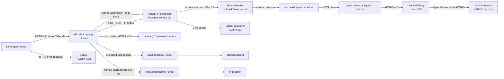
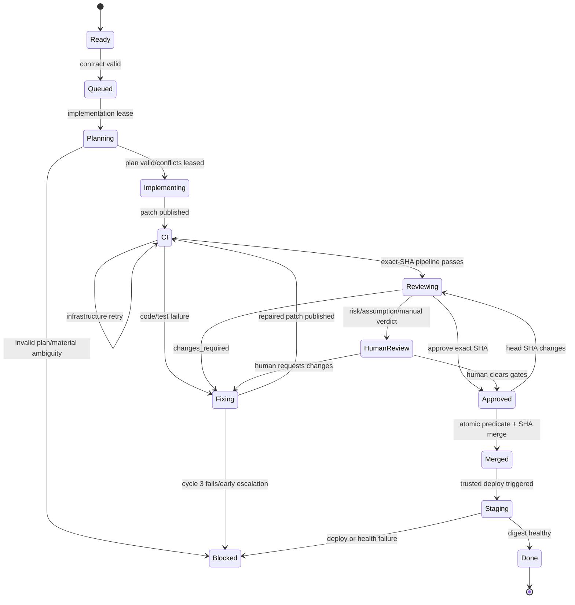

# Local Agentic Software Factory: Technical Design

**Status:** Implementable V1 design  
**Companion to:** [Local Agentic Software Factory Plan](./agentic-software-factory-plan.md)  
**Target:** GitLab Self-Managed Free unless a section explicitly identifies a paid-tier alternative

## 1. How to read this design

This document separates two kinds of statements:

- **Product capability** describes behavior guaranteed by linked official documentation.
- **Design decision** is the recommended V1 configuration for this factory. It is not a vendor guarantee.

GitLab remains the only operator-facing workflow and notification system. The orchestrator has no backlog UI, release UI, or chat notification channel. Its local database is a recoverable projection of GitLab state, not a competing source of truth.

All literal hostnames, numeric IDs, image digests, commit SHAs, timestamps, and UUIDs in fenced examples are illustrative and non-deployable. They define contract shape only; setup must substitute values generated by the actual GitLab instance, registry, and deployment.

### 1.1 Non-negotiable invariants

1. V1 model traffic for autonomous roles and interactive Jarvis routes only through LiteLLM to the configured, version-pinned Jarvis inference endpoint on the NVIDIA machine. Provider expansion is post-delivery and requires a recorded benchmark/config revision.
2. GitLab is authoritative for issues, merge requests, commits, pipelines, releases, environments, deployments, approvals, and operator-visible status.
3. At most two implementation tickets are active. A third model-execution slot is reserved for independent review or recovery.
4. Every planning, implementation, repair, and review session starts in a disposable container.
5. Untrusted containers never receive GitLab write tokens, application credentials, deployment credentials, provider keys, a Docker socket, or host filesystem access outside their run workspace.
6. A fresh-context review approval applies to one exact source-branch SHA. Any push invalidates it.
7. Three is the maximum number of combined repair cycles after the initial implementation. Infrastructure retries do not consume a repair cycle; code, test, or review failures do.
8. Only the orchestrator merge identity may merge autonomously. Production is never deployed by that identity.
9. `main` deploys automatically to shared staging. Production promotes the exact qualified OCI digest after an explicit developer action in GitLab; it is never rebuilt.
10. All control surfaces bind only to the tailnet or an internal VLAN. There is no public ingress to GitLab, the orchestrator, runners, model gateway, or inference endpoints.

## 2. System topology and trust boundaries



### 2.1 Named services and placement

| Service | Placement | Responsibility | Durable state | Trust class |
|---|---|---|---|---|
| `gitlab` and `registry` | Unraid, official GitLab container with dedicated config, log, and data volumes | Source of truth and OCI registry | GitLab volumes | Trusted core |
| `factory-orchestrator` | Proxmox control-plane VM | Webhook ingestion, reconciliation, policy, scheduling, GitLab API actions | SQLite WAL database | Trusted control |
| `factory-publisher` | Same VM, separate OS user and Unix socket | Validate a captured patch, commit it, and push only feature branches | Temporary bare clones; no long-term state | Trusted write boundary |
| `factory-launcher` | Isolated Proxmox worker VM, exposed only as an OpenSSH forced command | Create, monitor, and destroy per-run containers and sidecars | Short-lived run directories | Trusted execution broker |
| `litellm-proxy` | Proxmox control-plane VM | Stable OpenAI-compatible API and logical-to-physical model mapping | Configuration and logs only in V1 | Trusted model boundary |
| `runner-ci` | Isolated runner VM/network | Ordinary build and test jobs | Disposable Docker volumes/cache | Untrusted code execution |
| `runner-browser` | Isolated runner VM/network | Deterministic Playwright and bounded exploratory sessions | Disposable browser artifacts | Untrusted test execution |
| `runner-staging` | Staging network | Execute only trusted staging project jobs | None beyond runner config | Trusted deployment |
| `runner-production` | Production-reachable network | Execute only trusted production project jobs | None beyond runner config | Highest trust |
| `inference-jarvis` | NVIDIA machine | Sole V1 inference endpoint for Jarvis and factory roles | Model weights/cache | Separate inference boundary |
| off-host backup target | A different physical host or encrypted remote target | Nightly backup copies and restore media | Backup generations | Recovery boundary |

`factory-publisher` is a separate process even though it shares a VM with the orchestrator. Its Git credential is readable only by its OS user. The orchestrator sends a bounded publish request over a root-owned Unix socket; it never reads the token.

`factory-launcher` uses an SSH key whose server-side `authorized_keys` entry forces the launcher command and disables forwarding, PTY allocation, and arbitrary shell execution. The request contains a signed run specification, not a shell string. This avoids exposing a general Docker API or Docker socket over the network.

### 2.2 Network flows

| Source | Destination | Direction/port | Allow reason |
|---|---|---|---|
| Developer device | GitLab/registry | TCP 443; TCP 22 only if Git-over-SSH is retained | Human GitLab use |
| GitLab | Orchestrator | TCP 8443 HTTPS | Project webhooks |
| Orchestrator/publisher | GitLab/registry | TCP 443 | REST API and Git-over-HTTPS |
| Orchestrator | Worker | TCP 22 | Forced-command run lifecycle |
| CI/browser runners | GitLab/registry | TCP 443 and registry TLS port if separate | Poll jobs, clone, artifacts, images |
| Agent run network | Per-run model sidecar | Local container network only | Model calls without a credential in the agent |
| Model sidecar | LiteLLM | TCP 443 | Authenticated model request |
| LiteLLM | Selected inference endpoint | TCP 443 or endpoint-local TLS port | Inference only |
| Staging runner | Staging targets | Application-specific allowlist | Deployment and health check |
| Production runner | Production targets | Application-specific allowlist | Deployment and rollback only |
| Backup job | Off-host target | One restricted backup protocol/port | Nightly append/write |

Use Tailscale device tags `tag:factory-gitlab`, `tag:factory-control`, `tag:factory-worker`, `tag:factory-runner`, `tag:factory-staging`, and `tag:factory-production`. Grants are deny-by-default and can restrict destinations by protocol and port [S1]. Include policy tests that prove an agent/ordinary-runner tag cannot reach staging, production, GitLab SSH, hypervisors, Unraid administration, or inference endpoints directly.

## 3. GitLab topology

### 3.1 Groups and projects

Create this hierarchy:

```text
software-factory/
├── apps/                         application repositories only
└── platform/
    ├── orchestrator              orchestrator source and runbooks
    ├── ci-templates              protected common CI
    ├── agent-images              pinned agent/runtime images
    ├── agent-assets              versioned factory skills, commands, role prompts, and schemas
    ├── reference-app             contract conformance app
    ├── deploy-staging            trusted staging pipeline
    └── deploy-production         trusted production pipeline
```

Do not grant either apps bot at `software-factory/` or `software-factory/platform/`; group membership is inherited. Create group access tokens only at `software-factory/apps`, where their reach is intentionally limited to application projects. Group access tokens are available on Self-Managed with any license and create auditable bot users [S2].

All projects are private. Disable instance runners for these projects. Enable the integrated registry for application projects. Make registry visibility project-members-only.

### 3.2 Branch, merge, and tag policy

For every application project:

- Default branch: `main`.
- Merge method: fast-forward only. A target-branch update therefore requires a rebase and new exact-SHA review rather than creating an unreviewed merge commit.
- `main` and `release/*`: **Allowed to push and merge = No one** and **Allowed to merge = Maintainers**.
- Protected tags: `v*` may be created only by Maintainers.
- Enable **Pipelines must succeed** and **All discussions must be resolved**.
- Do not treat a skipped pipeline as successful.
- Delete source branch after merge.

Protected branches and successful-pipeline merge checks are Free capabilities [S3][S4]. GitLab warns that an unconfigured push permission is not equivalent to `No one`; set it explicitly [S3]. On Free, protection selects roles rather than a named bot, so both the human owner and the Maintainer-level orchestrator technically can merge. Policy makes the orchestrator the only automatic merge identity; the human retains emergency authority.

Any change to `.gitlab-ci.yml`, an included CI file, `.factory.yaml`, `scripts/bootstrap`, `scripts/check`, `scripts/build`, or `scripts/browser-test` automatically adds `gate::manual`. This is the Free-tier defense against an autonomous patch weakening its own checks. GitLab includes are deep-merged and the including file can override included content [S5]; an include alone is not a security boundary.

For `platform/ci-templates`, `platform/agent-images`, `platform/deploy-staging`, and `platform/deploy-production`, the developer is the only human member with write authority. Protect `main` from direct push. No implementation-agent identity is a member. The staging bot may trigger the staging project but cannot write its repository. No long-lived API bot is a member of `deploy-production`.

### 3.3 Labels

Create these as group labels under `software-factory/apps` so every project uses identical spelling:

| Scope | Values | Rule |
|---|---|---|
| `factory::` | `draft`, `ready`, `queued`, `planning`, `implementing`, `ci`, `reviewing`, `fixing`, `human-review`, `blocked`, `done` | Exactly one state label after admission |
| `priority::` | `critical`, `high`, `normal`, `low` | Default `normal`; exactly one |
| `gate::` | `database`, `authentication`, `assumption`, `manual` | Zero or more; all block autonomous merge |
| `factory-result::` | `passed`, `failed`, `canceled` | Optional terminal reporting label |

Only a human adds `factory::ready`. The orchestrator owns all later `factory::` transitions. If a human changes the state label after admission, reconciliation treats it as an explicit operator instruction: `blocked` cancels active work; `ready` retries only a previously blocked issue after the blocking reason is resolved.

### 3.4 Ready issue contract

An admitted issue must contain non-empty `Requirements`, `Acceptance criteria`, and `Technical constraints` headings. Dependencies may be expressed as GitLab blocking issue links, which are available on Free through the issue-links API, or under `Depends on` using unambiguous `#123` or `group/project#123` references [S6]. The API relation wins if text and links disagree; reconciliation comments on the discrepancy and blocks the issue rather than guessing.

A dependency is complete only when:

1. the dependency issue is closed; and
2. its managed merge request is merged, or the issue records that no code change was required.

### 3.5 Webhooks and manual gates

GitLab Free does not provide group webhooks; group webhooks are Premium/Ultimate [S7]. Therefore install one project webhook on each enrolled application project for:

- issue/work-item events;
- merge-request events;
- pipeline events;
- push events;
- note events;
- deployment and release events.

New GitLab versions support Standard Webhooks HMAC-SHA256 signing, `webhook-id`, and `webhook-timestamp`; validate the raw body, require a timestamp within five minutes, and compare signatures in constant time [S7]. If the installed GitLab version predates signing tokens, use the legacy `X-Gitlab-Token` over TLS and rotate it after upgrading. Return `202` only after the delivery is committed to SQLite.

Operator commands use labels and narrowly defined issue/MR comments:

```text
/factory retry
/factory cancel
/factory reconcile
/factory approve-assumption
```

A command is accepted only from the configured developer GitLab user ID, never by display name or username alone. The orchestrator posts the interpreted action back to the same thread.

### 3.6 Free implementation and Premium substitutions

| Concern | GitLab Free V1 | Premium/Ultimate substitution |
|---|---|---|
| Webhooks | One project webhook per app | One group webhook, with project hooks removed to avoid duplicates |
| Branch protection | Per-project role rules | Top-level group protected-branch rules; verify overlapping rules do not become more permissive [S3] |
| Agent approval | Orchestrator record + SHA-marked MR report; optional GitLab approval is display-only | Required approval rule for the independent reviewer; reset approvals on push |
| Code ownership | Review prompt and `gate::manual` for sensitive paths | Required Code Owner approval |
| Production boundary | Separate private production project, human-only membership, protected runner, human-started manual job | Protected production environment plus deployment approval; approval and job execution remain separate actions [S8][S9] |
| Secret scope | Separate projects/runners; protected masked project variables | Protected environment and environment-scoped variables where useful |
| CI policy | Immutable include plus manual gate on pipeline-contract changes | Pipeline execution policy if Ultimate is adopted |

GitLab Free approvals are optional and cannot block merging; required MR approvals are Premium/Ultimate [S10]. The orchestrator must therefore enforce its own exact-SHA approval on Free and must not infer safety from the green approval icon.

## 4. Identities, credentials, and authority

### 4.1 Identity matrix

| Identity | Location | GitLab role/scope | Can do | Cannot do |
|---|---|---|---|---|
| Human developer | Human devices | Owner | Create/ready issues, edit platform policy, emergency merge, start production | Nothing automated uses this credential |
| `factory-orchestrator` group token | Control VM | `apps` group, Maintainer, `api` | Read/write issues, labels, notes, MRs, pipelines; merge with exact SHA | Git push; staging/prod credentials |
| `factory-publisher` group token | Publisher OS user | `apps` group, Developer, `write_repository` | Pull and push unprotected `factory/*` branches | API calls; merge; protected branches |
| `staging-trigger` project token | Orchestrator secret store | `deploy-staging`, Maintainer, `api` | Create a staging pipeline | Read production project or credentials |
| `factory-launcher` registry credentials | Worker launcher secret store | One project deploy token per `agent-images`/`agent-assets` project, `read_registry` | Pull the two pinned OCI artifacts by digest | GitLab API, repository writes, application images |
| Ordinary CI job token | Per job | Automatically short-lived | Project registry and explicitly allowlisted resources | General API/write authority |
| Production CI job token | Human-started job | Per job | Read allowlisted app release/registry data | Persist after job; change app source |
| Runner authentication token | Runner config only | Runner registration/authentication | Poll assigned jobs | GitLab API |
| Model gateway credential | Model-egress sidecar only | LiteLLM | One configured model route | GitLab, deployment, or host access |
| Staging credential | `deploy-staging` protected masked variable/runner secret | Application-specific | Deploy staging only | Production |
| Production credential | `deploy-production` protected masked variable/runner secret | Application-specific | Deploy/rollback production only | Source or GitLab administration |

`api` grants complete REST API access within a project/group token's resource boundary; `write_repository` grants Git-over-HTTP push but not API authentication [S11]. Splitting these tokens prevents the orchestrator process from directly constructing and pushing arbitrary commits, and prevents the publisher from merging.

Set explicit expirations, record the owner and renewal date in a GitLab issue, rotate at least quarterly, and revoke immediately after suspected exposure. Project and group access tokens expose last-used time and recent IP addresses and can be rotated [S2][S12]. Do not use a personal access token.

### 4.2 Secrets never enter untrusted agent containers

The launcher starts a small, trusted `model-egress` sidecar on a private per-run network. The sidecar holds the model-gateway bearer value, permits only `/v1/chat/completions` and `/v1/models`, forces the run's logical model, adds `run_id` metadata, applies request/body limits, and proxies to LiteLLM. The agent receives only the sidecar URL and, if its client insists on a key field, a fixed non-secret dummy value. It cannot read the sidecar environment or connect directly to LiteLLM.

The same pattern applies to exploratory browser work: a trusted fixture broker creates a disposable test account and logs in before handing the browser agent a context restricted to the release test environment. The account contains synthetic data, cannot access administration, has a hard expiry shorter than the run deadline, and is deleted after the run. No reusable password, session for a real user, application secret, or deployment credential is placed in the agent container.

## 5. Runner pools and isolation

Create project or group runners with **Run untagged jobs disabled** and exactly these tags:

| Tag | Executor | Projects | Secrets/network |
|---|---|---|---|
| `ci-untrusted` | Docker, non-privileged | `apps/*` | No protected variables; GitLab/registry and approved public dependency egress only |
| `browser-deterministic` | Docker, non-privileged, pinned Playwright image | `apps/*` | Ephemeral test-user capability; test environment only |
| `deploy-staging` | Dedicated protected project runner | `platform/deploy-staging` only | Staging credential and staging routes |
| `deploy-production` | Dedicated protected project runner | `platform/deploy-production` only | Production credential and production routes |

Set runner maximum timeouts and project job timeouts. GitLab documents that runner maximum timeout wins when shorter [S13]. Use a per-job Docker network, `privileged = false`, no host PID namespace, no Docker socket, and `pull_policy = always` for private images. GitLab warns that shell executors and privileged reusable Docker runners can expose the host and tokens; non-privileged Docker plus network segmentation is the baseline [S14].

The two deploy runners execute only code from their trusted deployment projects. They never execute scripts from an application checkout. Give each a separate VM or at minimum a separate host and runner service account. Mark them protected and restrict them to protected refs; GitLab supports protected runners on Free [S13].

## 6. Repository and CI contract

### 6.1 `.factory.yaml`

Every enrolled repository contains this schema. The values in this example are illustrative and non-deployable:

```yaml
version: 1

agent:
  image: registry.factory.internal/software-factory/platform/agent-images/node-dotnet-playwright@sha256:4e6f7d7dc83db10bfa3bd6fb3bdaf0c75d35db3ecf8d228ef690593bcb11d9e5

commands:
  bootstrap: ./scripts/bootstrap
  check: ./scripts/check
  build: ./scripts/build
  browser_test: ./scripts/browser-test

artifacts:
  image: registry.factory.internal/software-factory/apps/example

services:
  - postgres-test

network:
  egress_hosts:
    - registry.npmjs.org
    - api.nuget.org
```

During setup, replace the illustrative agent-image reference above with the immutable digest actually built, scanned, and approved for the reference image. That selected digest is a reviewed manifest change and never a floating-tag update. The four command values are repository-relative executable paths, not shell fragments. V1 does not support arbitrary arguments or inline shell. `services` may contain only names from the protected platform service catalog; the launcher resolves each name to a pinned image digest, synthetic environment, health check, and resource limit. `egress_hosts` is optional and is a reviewed allowlist of public package/documentation hosts; IP literals, wildcards, private address ranges, and URL paths are invalid.

The orchestrator rejects unknown top-level keys, unsupported versions, mutable agent image references, absolute paths, `..`, symlinks escaping the worktree, non-executable command paths, and an image destination outside the project's registry namespace.

### 6.2 CI include strategy

Each app's `.gitlab-ci.yml` contains only a pinned include plus documented project-specific variables. The commit SHA below is illustrative and non-deployable:

```yaml
include:
  - project: software-factory/platform/ci-templates
    ref: 6f6f3f975ba70a0d4b09f3473f51aa996d9e32e6
    file: /templates/application-v1.yml
```

The 40-character ref is an immutable commit, not `main` or a tag. Upgrades are explicit MRs across enrolled repositories. The template owns stages and reserved job names prefixed `factory:`:

1. `factory:contract` validates `.factory.yaml` and scripts.
2. `factory:check` runs `bootstrap`, then `check`.
3. `factory:build` runs `build` and records provenance.
4. `factory:image` on `main` builds once, pushes `sha-$CI_COMMIT_SHA`, resolves the OCI digest, and emits `release-manifest.json`.
5. `factory:browser` runs only when the manifest declares a browser command and the pipeline policy requires it.
6. `factory:release-qualification` runs for `release/*` and consumes an existing successful `main` digest; it does not rebuild.

Application pipelines receive only normal `CI_JOB_TOKEN` access. GitLab job tokens are short-lived, revoked after the job, and expose a restricted API/resource set [S15]. Keep the inbound job-token allowlist enabled and add only the two deployment projects where cross-project release or registry reads are needed.

Artifacts have explicit expiry: ordinary logs/reports 30 days, failed Playwright evidence 60 days, release qualification evidence and `release-manifest.json` one year. GitLab supports per-artifact `expire_in`, keeps the most recent successful ref artifacts by default, and permits access restriction [S16].

### 6.3 Immutable image contract

`release-manifest.json` is the interface between build, staging, qualification, and production. This example contains illustrative, non-deployable IDs, SHAs, digest, and timestamp:

```json
{
  "schema_version": 1,
  "project_id": 42,
  "commit_sha": "0123456789abcdef0123456789abcdef01234567",
  "pipeline_id": 418,
  "image": "registry.factory.internal/software-factory/apps/example@sha256:89abcdef0123456789abcdef0123456789abcdef0123456789abcdef01234567",
  "built_at": "2026-09-22T18:10:00Z",
  "ci_template_sha": "6f6f3f975ba70a0d4b09f3473f51aa996d9e32e6"
}
```

All consumers require a digest reference. Human-friendly tags may exist but are never deployment inputs. GitLab's registry displays manifest/configuration digests and supports OCI images [S17].

## 7. Thin orchestrator design

### 7.1 Modules

Implement one statically deployable service with these internal modules, not separately deployed microservices:

- `webhook`: raw-body authentication, replay window, durable receipt.
- `gitlab`: typed REST client, pagination, rate-limit handling, and idempotent mutations.
- `projector`: folds deliveries and periodic API snapshots into local desired/observed state.
- `policy`: ready-contract validation, risk/manual gates, merge predicate.
- `scheduler`: priorities, dependencies, WIP lanes, and conflict leases.
- `launcher`: signed run-spec client for `factory-launcher`.
- `adapter`: OpenHands/OpenCode process adapters and schema validation.
- `publisher`: Unix-socket client for the trusted publisher.
- `reconciler`: startup and periodic comparison against GitLab.
- `reporter`: labels, idempotent notes, run-bundle uploads, metrics.
- `release`: staging trigger and release qualification projection; no production trigger method exists.

Do not add a queue product. A single process and SQLite in WAL mode are sufficient for one developer and three concurrent model sessions.

### 7.2 Durable SQLite schema

Use foreign keys, WAL mode, `busy_timeout`, UTC timestamps, and short write transactions. Migrations run before readiness becomes true.

| Table | Key fields and purpose |
|---|---|
| `webhook_delivery` | `delivery_id` primary key, event name, project ID, received time, payload SHA-256, payload JSON, processing state, attempts, error. Deduplication boundary. |
| `project` | GitLab ID, path, enabled flag, default branch, webhook mode, last full reconcile. |
| `work_item` | `(project_id, issue_iid)` primary key, global issue ID, GitLab update time, desired/observed state, priority rank, active MR IID, base SHA, terminal reason. |
| `dependency` | work-item key, dependency project/IID, source (`api` or `description`), satisfied snapshot. |
| `plan` | work-item key, run ID, base SHA, validated plan JSON, expected paths, risk flags, ambiguities. |
| `run` | UUID, work item, role, harness/model/config revisions, status, worker job ID, input/base/head SHA, repair cycle, started/heartbeat/finished timestamps, exit classification, artifact URL. |
| `merge_request` | project/IID, source/target branches, current head SHA, pipeline ID/status, merge status, last synchronized time. |
| `review` | project/MR IID/reviewed SHA primary key, reviewer run, verdict, report URL, created time, valid flag. |
| `lease` | `(kind, key)` primary key, owner run/work item, acquired, heartbeat, expiry. Kinds: `implementation-slot`, `review-slot`, `work-item`, `conflict`. |
| `transition` | monotonic ID, work item, from/to state, reason, GitLab event/delivery, actor, time. Audit and debugging. |
| `action` | deterministic idempotency key, action type, target, request hash, state, remote result ID, attempts. Prevent duplicate GitLab mutations. |
| `release_candidate` | project, release ref, commit SHA, image digest, qualification pipeline, test deployment, gate statuses, report URL, production deployment ID. |

Payloads and transcripts are bounded; the database stores references to large artifacts, not their bodies.

### 7.3 Event handling and reconciliation

Webhook delivery is a hint, not a transaction protocol:

1. Verify TLS endpoint, signing header/token, timestamp, and body size.
2. Insert by `delivery_id`. An existing identical hash returns `202`; the same ID with a different hash is a security error.
3. A worker folds the event into projections and enqueues deterministic `action` records.
4. Execute actions outside the SQLite transaction. Before retrying a mutation, read GitLab and detect whether the desired result already exists.
5. Mark the action complete and update the projection.

At startup and every 60 seconds, reconciliation lists:

- open issues carrying any `factory::` label;
- open MRs whose source branch begins `factory/` or carries the factory marker;
- latest MR pipelines and exact SHAs;
- open discussions and merge status;
- managed release branches, releases, environments, and deployments;
- worker containers labeled with the factory instance/run ID.

GitLab wins every disagreement except an active local lease that has not expired. Missing webhooks therefore delay work by at most one reconcile period. If SQLite is lost, stop dispatch, rebuild projections from GitLab, mark uncorrelated worker jobs canceled, and require human retry only for a patch that was captured but never published.

### 7.4 Scheduling algorithm

On each schedule tick:

1. Select open issues with `factory::ready` or `factory::queued` and a valid contract.
2. Refresh dependencies. Exclude unsatisfied, circular, missing, or inaccessible dependencies; comment and mark `blocked` for the latter three.
3. Map priority `critical=0`, `high=1`, `normal=2`, `low=3`, then order by `created_at`, project ID, IID.
4. Acquire one of two `implementation-slot` leases and the issue's `work-item` lease transactionally.
5. Dispatch planning. Validate the plan and derive normalized conflict keys.
6. Acquire all conflict leases in lexical order. If unavailable, release the implementation slot, retain `queued`, and try the next issue. This prevents head-of-line blocking.
7. Hold the work-item and conflict leases through publish/CI/review/merge or terminal block. The model slot itself is released while waiting for CI.
8. Admit review/recovery only through the third `review-slot`. Implementation never borrows that slot. Recovery may use it only when no review is runnable.

Material conflict keys are namespaced:

```text
migration:<project>:<chain-or-database>
auth:<project>:<boundary>
bootstrap:<project>:<entrypoint>
route:<project>:<router-or-root>
contract:<project>:<public-contract-name>
```

Lockfiles, generated files, documentation, broad directories, and ordinary overlapping source files do not create leases. The planner must provide a reason; the orchestrator rejects unknown key kinds. A conflict lease heartbeat is 15 seconds and its expiry is 90 seconds. Reconciliation does not dispatch a replacement until it has confirmed the old worker is absent and the expiry has elapsed.

### 7.5 State machine



### 7.6 Service surface

Bind all endpoints to the control VM's tailnet address:

| Method/path | Caller | Behavior |
|---|---|---|
| `POST /hooks/gitlab` | GitLab only | Signed webhook receipt; `202` after durable insert |
| `GET /health/live` | Proxmox/systemd | Process and event-loop liveness only |
| `GET /health/ready` | Proxmox/systemd | SQLite migrated/writable, GitLab reachable with current token, publisher socket and worker reachable; `503` otherwise |
| `GET /metrics` | allowlisted Prometheus | Prometheus metrics, no source/transcript labels |
| `GET /api/v1/runs/{uuid}` | Developer over Tailscale | Read-only run status and GitLab artifact links |
| `POST /api/v1/reconcile` | Developer over Tailscale | Wake a reconciliation cycle; no direct state override |
| `POST /api/v1/drain` | Developer over Tailscale | Stop new dispatch while active runs finish |

Every workflow mutation still originates in GitLab or deterministic reconciliation. There is no endpoint to approve, merge, or deploy production.

## 8. Agent execution

### 8.1 Run lifecycle

1. The orchestrator resolves the issue, immutable base SHA, agent-image digest, agent-assets digest, role, selected skills/command, prompt revision, harness revision, model alias, service dependencies, limits, and network policy into `run-spec.json`. It signs the canonical run specification with a launcher-verification key.
2. The publisher/checkout helper clones with a credential outside the worker, verifies the commit, removes credential material from remotes/config, and creates a clean workspace archive containing credential-free `.git` metadata.
3. The launcher verifies the run-spec signature, rejects expired or replayed run IDs, pulls the agent image and agent-assets OCI artifact by digest, verifies both digests, and creates a run directory owned by a unique UID.
4. The launcher creates a private per-run network, starts the model-egress sidecar, and, only when declared by an approved repository contract, starts pinned disposable service containers such as PostgreSQL or Redis. Service containers have synthetic credentials, ephemeral volumes, health checks, and no route outside the run network.
5. The adapter materializes a harness-specific ephemeral home from the read-only agent-assets bundle. It mounts the source workspace read-write at `/workspace`, the verified bundle read-only at `/opt/factory/assets`, and tmpfs-backed `/tmp` and harness home directories. Neither the host's user configuration nor the developer's personal `aitooling/` installation is mounted.
6. The launcher starts the agent as non-root with a read-only root filesystem, all Linux capabilities dropped, `no-new-privileges`, seccomp/AppArmor, PID/memory/CPU/pids limits, and no host or Docker-socket mounts.
7. The launcher waits for declared service health checks, starts the role adapter, records container IDs by `run_id`, and heartbeats the orchestrator. The adapter streams bounded JSONL tool events and captures stdout/stderr with a hard byte limit. Hidden model reasoning is not requested or stored.
8. On normal completion, the adapter validates the role's structured result before returning success. On cancel or timeout, the launcher sends `SIGTERM` to the process group, allows 30 seconds for log flush, then sends `SIGKILL`.
9. The launcher stops writes to the workspace, records an inventory and diff, and returns the patch, structured result, service logs, resource usage, and exit classification to the orchestrator. Agent-assets and harness-home paths are excluded from the patch.
10. The orchestrator validates paths, size, schema, unexpected files, and forbidden file types. The publisher re-clones the expected base, applies the patch with no fuzz, rejects submodules, tree-escaping symlinks, embedded credentials, and an unexpected base SHA, then commits and pushes the feature branch.
11. The launcher removes the agent, service containers, sidecar, network, tmpfs mounts, writable volumes, workspace, and run directory in that order. Cleanup is idempotent and keyed by `run_id`.
12. On launcher restart, a garbage-collection pass compares labeled containers/networks/volumes with active orchestrator leases. It preserves a live leased run, removes expired orphaned resources, and reports every cleanup action; it never resumes an uncorrelated agent process.

V1 uses Docker Engine on the isolated worker VM. Only the trusted `factory-launcher` OS account can access its local Unix socket; the socket has no TCP listener and is never mounted into a run. The launcher uses one `read_registry` project deploy token for each protected platform artifact project. The orchestrator can request a signed lifecycle operation but cannot call Docker or use either registry credential directly.

Default limits, adjusted only in versioned role policy:

| Role | Wall clock | CPU | Memory | Output/diff |
|---|---:|---:|---:|---:|
| Plan | 20 min | 2 cores | 8 GiB | 2 MiB log; no patch |
| Implement/repair | 90 min | 4 cores | 16 GiB | 20 MiB log; 25 MiB patch |
| Review | 30 min | 2 cores | 8 GiB | 5 MiB report |
| Release deep review | 60 min | 4 cores | 16 GiB | 10 MiB report |
| Exploratory browser | 20 min or 150 actions, whichever first | 2 cores | 8 GiB | 250 MiB evidence |

A second timeout guard exists in the launcher rather than inside the harness, so a stuck or compromised harness cannot suppress termination. Exceeding a role budget is a code/workflow failure only when the model was making progress; a launcher or host outage is infrastructure.

### 8.2 Network policy

Planning and review containers have only the model sidecar and no external egress. Implementation/repair containers use a forward proxy that permits HTTPS CONNECT only to the manifest's exact `egress_hosts`; the firewall blocks direct outbound traffic, DNS except the proxy resolver, RFC1918, tailnet ranges, link-local/metadata addresses, GitLab, hypervisors, deployment networks, and inference hosts. Browser containers can reach only the exact test origin and fixture broker.

Bootstrap dependencies should move into the pinned agent image or an internal read-only cache over time. Do not solve package failures by granting general LAN access.

### 8.3 Harness adapter and bake-off

Implement one process-adapter interface:

```text
run(role, workspace, task.json, policy.json) ->
  events.jsonl + result.json + exit.json + workspace.diff
```

Bake off OpenHands headless first and OpenCode second on the fixed Jarvis readiness suite. OpenHands headless emits JSONL but always approves tool execution, making the container boundary mandatory [S18]. OpenCode supports non-interactive `run` and explicit tool permissions [S19]. Pin the executable/container digest and configuration; do not select by feature count.

Score completion, acceptance satisfaction, tool correctness, structured-output validity, recovery, review precision/recall, latency, token use, and concurrency. Select one harness for V1 before unattended merge is enabled; retain only its adapter and the losing adapter's benchmark branch until the decision issue closes. Do not build a generic plugin framework.

### 8.4 Factory-owned skills, commands, and prompts

The factory does not mount or synchronize the developer's personal `aitooling/` tree. Create a dedicated, protected `platform/agent-assets` project as the source of truth for automation behavior:

```text
agent-assets/
├── manifest.yaml
├── roles/
│   ├── planner/system.md
│   ├── implementer/system.md
│   ├── reviewer/system.md
│   ├── release-reviewer/system.md
│   └── browser-tester/system.md
├── commands/
│   ├── plan.md
│   ├── implement.md
│   ├── repair.md
│   ├── review.md
│   └── explore-browser.md
├── skills/
│   └── <skill-name>/SKILL.md
├── schemas/
│   ├── plan.schema.json
│   ├── implementation.schema.json
│   └── review.schema.json
└── harness/
    ├── openhands.yaml
    └── opencode.json
```

Skills are reusable engineering guidance. Commands are bounded headless workflows selected by the orchestrator; an autonomous agent cannot invoke an arbitrary command set. Role manifests allowlist one command, the skills that may be loaded, tools, output schema, model alias, and resource policy. Only selected skill text enters the initial context; the verified bundle remains readable so a harness that supports on-demand skills can load approved supporting files without receiving every skill up front.

CI for `platform/agent-assets` validates frontmatter/schema, relative paths, referenced skills and assets, size limits, absence of symlinks and secrets, harness compilation, and the reference-task conformance suite. A successful protected release packages the tree as a read-only OCI artifact in the GitLab registry. The release records its source commit and content digest. Moving a production role to a new bundle digest is a reviewed orchestrator configuration change; existing runs keep their original digest, and rollback pins the previous digest.

The adapter translates the same canonical bundle into the chosen harness's native layout inside an ephemeral home directory. If a harness lacks native skills or commands, the adapter composes the selected files into the system/task messages rather than teaching the orchestrator harness-specific prompt semantics. Effective instruction precedence is:

1. launcher-enforced tool, filesystem, network, credential, and resource policy;
2. factory role system prompt;
3. selected factory command and skills;
4. repository-local guidance from the checked-out commit;
5. GitLab issue requirements and acceptance criteria.

Lower levels cannot expand permissions granted by higher levels. Repository text and issue content remain untrusted inputs even when they resemble instructions.

Every run bundle records the agent-assets Git commit, OCI digest, role, command, selected skills, individual content hashes, compiled-prompt hash, and adapter version. This makes a result reproducible and allows review to prove which policy produced it. Factory assets may initially be derived from useful personal material, but after import they have an independent review and release lifecycle.

### 8.5 Structured plan schema

The planner returns exactly the following shape; its IDs and SHA are illustrative and non-deployable:

```json
{
  "schema_version": 1,
  "issue": {"project_id": 42, "iid": 123},
  "base_sha": "0123456789abcdef0123456789abcdef01234567",
  "summary": "Add account export with an asynchronous status view.",
  "approach": [
    {"step": 1, "change": "Add the export endpoint", "paths": ["src/export/**"]}
  ],
  "acceptance_checks": [
    {"criterion": "Export completes", "evidence": "Run ./scripts/check and exercise the export flow"}
  ],
  "expected_paths": ["src/export/**", "tests/export/**"],
  "conflict_keys": [
    {"key": "route:42:api-root", "reason": "Adds a root API route"}
  ],
  "risks": {
    "database": false,
    "authentication": false,
    "ci_contract": false,
    "deployment": false
  },
  "ambiguities": [],
  "decision": "proceed"
}
```

`decision` is `proceed` or `blocked`. An ambiguity contains `question`, `impact`, and `safe_assumption`; any ambiguity without a low-impact safe assumption forces `blocked`. A risk flag adds the corresponding gate. Expected paths are advisory for conflict detection and review, not an edit sandbox; unexpected paths must be explained in the implementation result.

### 8.6 Structured review schema

The fresh reviewer receives the issue, plan, diff, repository at the exact head SHA, CI results, and no implementation transcript. It returns the following shape; its IDs and SHA are illustrative and non-deployable:

```json
{
  "schema_version": 1,
  "project_id": 42,
  "merge_request_iid": 77,
  "reviewed_sha": "fedcba9876543210fedcba9876543210fedcba98",
  "verdict": "changes_required",
  "criteria": [
    {"criterion": "Export completes", "status": "failed", "evidence": "The canceled job remains in running state"}
  ],
  "findings": [
    {
      "id": "REV-1",
      "severity": "blocking",
      "category": "correctness",
      "path": "src/export/worker.ts",
      "line": 84,
      "title": "Cancellation leaves the export running",
      "evidence": "The cancel path returns before persisting terminal state.",
      "required_change": "Persist canceled state before returning."
    }
  ],
  "risks": [],
  "summary": "One blocking state-transition defect."
}
```

Verdicts are `approve`, `changes_required`, `human_review`, or `blocked`. `approve` requires every criterion `passed`, no blocking finding, an identical `reviewed_sha`, and no unresolved risk. `changes_required` requires at least one actionable blocking finding. `human_review` requires one or more explicit risk/assumption reasons. Invalid JSON or schema is retried once within the same run; a second invalid result blocks the run without consuming a repair cycle.

### 8.7 Logs and artifacts

Each run bundle contains `run.json`, `task.json`, validated structured result, `events.jsonl`, sanitized stdout/stderr, command exit codes/durations, diff/stat, harness/model/prompt revisions, token/latency usage, and redaction report. The orchestrator uploads the compressed bundle through GitLab's project Markdown Uploads API and links it from one idempotently updated issue/MR note; uploads are a Free feature [S20]. Logs redact configured token patterns before disk and have size limits. Jarvis readiness scorecard runs are retained; routine run uploads are deleted after 90 days by a scheduled trusted cleanup.

## 9. Model gateway and Jarvis routing

### 9.1 LiteLLM configuration

LiteLLM exposes an OpenAI-compatible proxy with model aliases and can map one alias to one or more deployments [S21]. V1 deliberately does **not** enable LiteLLM virtual-key management because official virtual keys require PostgreSQL [S22], an otherwise unnecessary stateful dependency. Authentication stays in trusted per-run sidecars. Add PostgreSQL and per-run LiteLLM virtual keys only if measured V1 operations show that gateway-native budgets or revocation justify the operational cost.

Public logical aliases remain:

```text
factory-primary
factory-review
factory-release-review
jarvis-coding
jarvis-general
```

Every V1 alias maps to the same version-pinned Jarvis deployment on the NVIDIA machine. Aliases express role policy and accounting; they do not select providers. The orchestrator selects the alias once at run start from role policy, while LiteLLM resolves it to Jarvis.

The version-controlled Jarvis configuration records the endpoint/deployment identifier, model revision, inference runtime and version, context limit, tool and reasoning parser, sampling defaults, and concurrency policy. Each run bundle records that configuration revision. The trusted sidecar and gateway enforce role request-size and concurrency limits so autonomous work cannot exhaust the configured review/recovery capacity or make interactive Jarvis unusable.

The gateway never silently substitutes a model or provider. Jarvis transport failure retries at most twice with bounded exponential backoff, then blocks the run as infrastructure without consuming a repair cycle. A material Jarvis configuration change requires a new fixed-suite benchmark/config revision before it is used for unattended work.

## 10. Ordinary issue-to-merge flow

```mermaid
sequenceDiagram
    participant H as Human
    participant G as GitLab
    participant O as Orchestrator
    participant W as Disposable agents
    participant P as Publisher
    participant C as CI

    H->>G: Add factory::ready
    G->>O: Signed issue webhook
    O->>G: Validate issue/dependencies; label queued
    O->>W: Plan at base SHA
    W-->>O: Validated plan/conflict keys
    O->>W: Implement in fresh workspace
    W-->>O: Patch + evidence
    O->>P: Publish(expected base SHA, patch)
    P->>G: Push factory branch
    O->>G: Open/update MR
    G->>C: MR pipeline
    C-->>O: Pipeline webhook
    O->>W: Fresh review of exact head SHA
    W-->>O: SHA-bound verdict
    alt repair required
        O->>W: Repair with findings
        W-->>O: New patch
        O->>P: Publish new SHA
        Note over O,W: CI + fresh review repeat; max 3 cycles
    else gate required
        O->>G: human-review label and report
        H->>G: Clear gate or request changes
    else approved
        O->>G: Re-read all predicates and merge with sha parameter
        G-->>O: Merged or 409 SHA mismatch
    end
```

### 10.1 Publish and MR idempotency

The branch name is `factory/p-{project_id}-i-{issue_iid}` and one open MR per issue targets `main`. The commit includes trailers `Factory-Issue`, `Factory-Run`, and `Factory-Base-SHA`. Publisher requests are keyed by `(project, issue, base_sha, patch_sha256)`. An identical branch head is a no-op; a different unexpected head blocks rather than force-pushing.

The MR description contains the issue link, plan summary, acceptance checks, assumptions, risk gates, current repair cycle, and links to run bundles. Notes contain hidden markers such as `<!-- factory:review:fedcba... -->` so updates are idempotent.

### 10.2 Repair accounting

The initial implementation is cycle 0. A repair cycle starts only when a code/test failure or `changes_required` verdict is handed to a repair agent and ends after its new SHA completes CI/review. Maximum cycle is 3.

Do not consume a cycle for runner offline, GitLab 5xx/429, webhook loss, image-pull infrastructure error, or model endpoint transport failure. Retry those at most twice with bounded exponential backoff, then block as infrastructure. Consume a cycle for compiler/test failures, deterministic browser failures, violated acceptance criteria, merge conflicts requiring edits, or reviewer findings.

Escalate before three cycles when the same substantive finding survives one attempted repair, acceptance criteria must change, scope materially expands, a database/authentication risk emerges, deterministic verification is unavailable, tests are nondeterministic, or reviewer and implementer disagree on the contract.

### 10.3 Atomic merge predicate

Immediately before merging, in one reconciliation pass, re-read and require:

- issue and dependencies still eligible;
- MR open, non-draft, target `main`;
- MR `sha` equals the stored valid review SHA;
- latest MR pipeline for that SHA succeeded;
- all discussions resolved;
- no conflict and GitLab reports mergeable;
- no `gate::*` or human-review state remains;
- repair count at most three;
- no CI/manifest trust file changed without human approval.

Call GitLab's merge API with the exact `sha`. GitLab returns `409` if it no longer matches source HEAD [S25]. Treat `409` as approval invalidation, never as retry-with-current-head. If `main` advanced, perform a clean rebase, rerun CI, and obtain a fresh review; a conflict needing edits consumes a repair cycle.

After merge, do not close the issue yet. Wait for staging success for the emitted digest; then label `done`, close the issue, and post the deployment link/digest.

## 11. Staging and release

### 11.1 Automatic staging

A successful `main` pipeline emits a manifest and webhook. The orchestrator validates project, commit, pipeline status, manifest schema, and digest, then starts `platform/deploy-staging` with non-secret identifiers. That trusted project's immutable script retrieves the manifest, pulls by digest, acquires GitLab resource group `staging-{project_id}`, deploys, performs a bounded health check, and records a GitLab `staging` environment deployment. Resource groups serialize deployment jobs on Free [S26].

The staging runner alone holds staging credentials. Application CI cannot trigger a deployment command directly and cannot edit the trusted deployment project. A failed staging deployment leaves the issue/MR history intact, marks the issue blocked, and preserves both attempted and previous healthy digests.

### 11.2 Release qualification

A release starts by creating protected `release/<version>` from a commit already on `main`. The orchestrator rejects a release branch whose tip lacks a successful main pipeline and immutable manifest.

Qualification performs, in order:

1. Resolve the existing image digest for the branch tip; no build occurs.
2. Acquire the per-project release/staging resource group and deploy that digest to the shared test environment.
3. Run repository `check` and any release-specific verification against the exact SHA.
4. Run the deterministic Playwright suite against the exact deployed digest.
5. Run fresh deep review over the delta from the prior production release tag to the candidate SHA.
6. Run one bounded exploratory browser agent.
7. Create/update a GitLab Release with one report containing commit, digest, previous production digest, every gate result, evidence links, model/harness revisions, environment URL, and timestamps. GitLab Releases and the Releases API are Free; the API accepts `CI_JOB_TOKEN` for release operations [S27].
8. Expose the production project's manual job only after blocking gates are green.

V1 has no automatic freeze. The human must avoid unrelated staging merges during qualification. Every browser and release result records the exact observed digest; if staging changes, qualification is stale and reruns.

### 11.3 Deterministic Playwright gate

Use a Playwright container pinned by digest, Chromium only, fixed locale/timezone/viewport, controlled test data, one worker initially, and a clean browser context per test. Playwright recommends one CI worker for stability and uses isolated browser contexts by default [S28][S29].

The gate produces JUnit XML, HTML report, screenshots on failure, video only on failure, trace on first retry, browser console errors, and failed network requests. Permit one retry solely to capture the trace; a pass-on-retry marks the gate flaky and blocks release until the human classifies it. Playwright documents `trace: on-first-retry` for CI [S30]. Add browsers or sharding only after measured suite duration or a real compatibility defect justifies it.

### 11.4 Exploratory browser agent

This gate is advisory. It receives release criteria, the test URL, a pre-authenticated disposable synthetic account, and a 20-minute/150-action budget. It probes boundary values, unusual navigation order, refresh/back/forward, empty/loading/error states, keyboard use, stale state, and cross-page inconsistency. It cannot access GitLab or any other origin.

Every finding includes reproducible actions, expected/observed behavior, screenshot/trace, console/network evidence, severity suggestion, and confidence. The developer classifies it in GitLab as `release blocker`, `follow-up issue`, `expected`, or `not reproducible`. Unclassified findings prevent the production job from becoming actionable; findings themselves do not autonomously fail production.

### 11.5 Production authority and rollback

`platform/deploy-production` is private and human-only. The human starts a pipeline for the GitLab release/tag and then runs the manual `promote-production` job. On Free, project membership—not a paid protected-environment rule—is the authorization boundary. The job:

1. fetches the release and qualified manifest through its short-lived job token from the allowlisted application project;
2. verifies release tag, commit SHA, digest, and green qualification report;
3. pulls and deploys `image@sha256:...` without building;
4. records a GitLab `production` environment deployment;
5. writes rollback metadata: new digest, prior digest, deployment IDs, commit/tag, deploy time, schema compatibility note, and operator user.

The manual `rollback-production` job accepts a prior successful deployment ID, resolves its recorded digest, requires the human to run it, and deploys that digest. It never uses a mutable tag. GitLab environments/deployments retain what SHA/ref was deployed and provide deployment records [S31][S32]. Database rollback remains application-specific; any candidate with a non-backward-compatible migration requires `gate::database` and a documented human rollback procedure before promotion.

## 12. Failure recovery and operating behavior

| Failure | Detection | Automatic action | Final authority/state |
|---|---|---|---|
| Duplicate/out-of-order webhook | Delivery key and GitLab re-read | Deduplicate; reconcile current object | GitLab current state |
| Orchestrator restart | Startup reconcile | Rebuild queue, invalidate expired leases, find worker jobs | Resume only from safe observed state |
| Worker disappears | Heartbeat/SSH failure | Wait lease expiry, confirm absence, retry infrastructure twice | Then `blocked` |
| Agent/model transport failure | Exit classification | Retry same pinned config twice; no model substitution | Then `blocked` |
| Patch base changed | Publisher base check | Reject; rebase/replan as appropriate | New CI and review required |
| Pipeline code/test failure | Pipeline for exact SHA | Repair cycle | Block at cycle 3 or earlier rule |
| Review finding | Structured report | Repair cycle | Exact-SHA rereview |
| GitLab unavailable | Readiness and API errors | Stop new dispatch; retain durable deliveries/actions | Resume after reconcile |
| LiteLLM unavailable | Health/transport error | Stop model dispatch; active run bounded retry | No cloud fallback after cutover unless explicitly enabled |
| Staging deployment failure | Deployment/health status | Keep prior digest, block issue | Human investigates/retries |
| Production deploy failure | Trusted job | Stop; do not rewrite release; expose manual rollback | Human only |
| SQLite corruption/loss | Integrity/open failure | Drain; restore latest snapshot or rebuild from GitLab | Captured-unpublished patches need human decision |
| Token expiry | expiry event/daily check | Create/update GitLab incident issue 30 days ahead | Human rotates |

Do not retry an unsafe GitLab write blindly. Each mutation has an idempotency key and a read-before-retry rule. Respect `Retry-After` for `429`, use jittered bounded backoff for `5xx`, and surface exhaustion in the owning GitLab issue.

## 13. Backup and restore

### 13.1 Nightly backup set

Keep seven daily and four weekly encrypted, off-host generations:

1. GitLab backup archive: database, repositories, uploads, artifacts, logs, LFS, packages, and filesystem-backed registry data.
2. GitLab configuration and secrets volume, TLS certificates, and SSH host keys as a separately encrypted archive.
3. Registry/object storage copied independently if configured outside GitLab's filesystem backup.
4. Orchestrator consistent snapshot created through SQLite's online backup API, plus service configuration, prompts, JSON schemas, and migration version.
5. LiteLLM configuration and provider-secret file, encrypted separately.
6. Runner configuration/registration inventory; prefer re-registration over treating runner tokens as irreplaceable.
7. Tailscale policy export and tests.

GitLab's backup includes many application data classes but excludes configuration, secrets, TLS/SSH keys, Redis, and externally stored object data; those require separate treatment [S33]. GitLab can restore only into the exact same GitLab version and edition and needs the original secrets to decrypt protected values [S34]. Record GitLab version/edition and container digest alongside every backup.

### 13.2 Restore drill

Quarterly, restore into an isolated network:

1. Provision the exact recorded GitLab version/edition with empty data volumes.
2. Restore configuration/secrets and storage names, then the GitLab backup and any external registry/object data.
3. Run GitLab's documented configuration, secrets-decryption, artifact/LFS/upload integrity checks.
4. Restore the orchestrator snapshot with all outbound writes disabled.
5. Point it at restored GitLab, run dry reconciliation, and compare issue/MR/release counts and sampled repository SHAs/digests.
6. Re-register disposable runners; rotate restored webhook, bot, and runner tokens before any production reconnection.
7. Exercise one reference issue from ready through staging and verify production remains inaccessible.
8. Record actual recovery time and data age in a GitLab restore-drill issue.

V1 target is no more than 24 hours of GitLab/orchestrator state loss and restoration within one working day. These are design objectives to validate in drills, not guarantees from GitLab.

## 14. Observability

Emit JSON logs with `timestamp`, `level`, `service`, `instance`, `run_id`, project/IID/MR/pipeline IDs, state transition, action key, duration, and error class. Never log webhook signatures, access tokens, provider keys, full prompts, environment variables, or source file bodies.

Expose at least:

```text
factory_webhook_total{event,result}
factory_webhook_lag_seconds
factory_reconcile_duration_seconds
factory_queue_items{state,priority}
factory_active_leases{kind}
factory_run_total{role,result,model_route}
factory_run_duration_seconds{role}
factory_repair_cycle_total{result}
factory_gitlab_api_total{method,status_class}
factory_model_request_total{logical_model,result}
factory_model_tokens_total{logical_model,direction}
factory_publish_total{result}
factory_staging_deploy_total{result}
factory_release_gate{gate,status}
factory_backup_age_seconds{component}
```

Do not put project names, issue IDs, run IDs, URLs, or error text in metric labels. Link logs to GitLab by numeric IDs.

Use the bundled GitLab Prometheus for GitLab itself and either its custom scrape configuration or the existing homelab Prometheus for factory endpoints. GitLab's bundled Prometheus listens on localhost by default and its exporters are unauthenticated, so keep metrics on the private network and IP-allowlist scrapers [S35]. GitLab exposes `/-/health`, `/-/readiness`, and `/-/liveness`; use readiness with dependencies for monitoring, not as a public endpoint [S36].

Because GitLab is the only V1 notification surface, the orchestrator opens or updates one `factory incident` issue for: dispatch stopped over 10 minutes, webhook lag over 5 minutes, token expiry under 30 days, oldest backup over 30 hours, repeated worker failure, or release gate infrastructure failure. If GitLab itself is down, local logs/health are the only signal; this limitation is accepted for V1 and must be included in the restore drill.

## 15. Security threat model

| Threat | Primary controls | Residual risk/response |
|---|---|---|
| Prompt injection in issue/repository | Treat all content as data; no control credentials; fixed tools; network deny; fresh review | Agent can damage its disposable workspace; discard run |
| Credential exfiltration | No durable secret in agent; model/browser broker sidecars; blocked private networks; log redaction | A run can consume its bounded model/test capability; revoke run at launcher |
| Malicious CI edit | Manual gate on CI contract paths; pinned include; no deploy secrets in app pipeline | Ordinary tests could still be weakened; human reviews gated change |
| Container escape | Non-root, no privileged mode/socket/host mounts, cap drop, seccomp/AppArmor, dedicated VM/network | Docker is not a hostile-code proof sandbox; rebuild worker VM after suspected escape |
| Cross-job data theft | Fresh workspace/network/UID; cleanup; `GIT_STRATEGY` clean clone; no shared credential cache | Reimage runner on cleanup failure |
| Webhook forgery/replay | TLS, HMAC/raw-body validation, five-minute timestamp, delivery dedupe | Legacy GitLab secret-token mode is weaker; upgrade/migrate |
| Approval TOCTOU | Review stored by SHA, invalidate on push, atomic re-read, merge API `sha` | Target rebase changes SHA and forces rereview |
| Dependency or package compromise | Pinned base images, lockfiles, egress allowlist/cache, build provenance | Upstream artifact can still be malicious; block/rotate image and investigate |
| Registry tag substitution | Deploy digest only; manifest links SHA/pipeline/template | Registry administrator remains trusted |
| Production credential theft | Separate project/runner/network, human-only job, protected variables, no app checkout | Revoke credential and roll back using recorded digest |
| Model endpoint compromise | Separate inference VLAN, model-only protocol, no credentials/source writes at gateway | Source is sent to the configured Jarvis endpoint; provider expansion requires an explicit benchmark and approval |
| Backup theft | Encryption, separate config/secrets archive, restricted off-host account, restore-time rotation | GitLab data remains sensitive; revoke all restored tokens after DR |
| Same-model review blind spot | Fresh context, deterministic CI, adversarial-review benchmark, risk/manual gates, human production gate | Correlated mistakes remain possible; production is not autonomous |

## 16. Post-delivery inference scale-up

V1 has one physical provider: Jarvis on the NVIDIA machine. Strix Halo and cloud endpoints are optional post-delivery capacity or provider-diversity experiments. They are never an automatic fallback for Jarvis.

To evaluate a candidate endpoint:

1. Create a distinct versioned gateway configuration containing the endpoint, model revision, runtime, quantization or data type where applicable, context limit, parsers, sampling defaults, and concurrency policy.
2. Run the complete fixed Jarvis readiness suite at the candidate's intended concurrency. For cloud endpoints, pin the exact upstream provider and disable fallback [S23]. For RunPod, record the vLLM runtime, GPU type, and serving configuration [S24].
3. Record correctness, acceptance satisfaction, structured-output validity, review precision/recall, latency, token use, memory headroom where applicable, and transport-failure behavior in GitLab.
4. Complete an inference-host outage exercise and demonstrate that an unavailable candidate blocks work rather than silently rerouting it.
5. Require a developer-approved GitLab decision before mapping a factory alias to the candidate endpoint.
6. Run a bounded canary at WIP one before allowing the normal two implementation slots and reserved review/recovery slot.

The gateway configuration is the only changed provider-facing component. The orchestrator, signed run specification, sidecar credential boundary, agent-container isolation, and GitLab workflow remain unchanged.

## 17. Decisions that require implementation evidence

These are the only intentionally open V1 choices:

1. **OpenHands versus OpenCode:** choose from frozen Jarvis readiness results for completion quality, tool reliability, schema validity, recovery, context behavior, and latency.
2. **Jarvis model revision, context, parser, sampling configuration, and concurrency limits:** choose from the fixed readiness suite before unattended merge is enabled.
3. **Docker hardening versus stronger per-run VM/microVM isolation:** begin with the specified disposable Docker boundary on a dedicated VM; move to microVMs only if adversarial testing, repository sensitivity, or container-escape risk justifies the complexity.
4. **Dependency egress cache/allowlist:** derive the smallest reliable host list from the fixed task suite; do not grant unrestricted private-network access to fix package installation.
5. **Playwright concurrency and browser matrix:** start with one Chromium worker; add sharding/Firefox/WebKit only from measured duration or actual compatibility defects.
6. **LiteLLM virtual-key database:** retain the credential-holding sidecar/no-PostgreSQL design unless measured V1 operations show per-key budgets/revocation materially improve control.
7. **Registry backup method/retention:** filesystem backup is sufficient initially; choose object-storage replication only after measured registry size and backup window require it.

## 18. Official sources

- **[S1]** Tailscale, [Grants](https://tailscale.com/docs/features/access-control/grants) and [policy syntax](https://tailscale.com/docs/reference/syntax/policy-file).
- **[S2]** GitLab, [Group access tokens](https://docs.gitlab.com/user/group/settings/group_access_tokens/).
- **[S3]** GitLab, [Protected branches](https://docs.gitlab.com/user/project/repository/branches/protected/).
- **[S4]** GitLab, [Auto-merge and successful pipeline requirement](https://docs.gitlab.com/user/project/merge_requests/auto_merge/).
- **[S5]** GitLab, [Use CI/CD configuration from other files](https://docs.gitlab.com/ci/yaml/includes/).
- **[S6]** GitLab, [Issue links API](https://docs.gitlab.com/api/issue_links/).
- **[S7]** GitLab, [Webhooks](https://docs.gitlab.com/user/project/integrations/webhooks/) and [webhook events](https://docs.gitlab.com/user/project/integrations/webhook_events/).
- **[S8]** GitLab, [Protected environments](https://docs.gitlab.com/ci/environments/protected_environments/).
- **[S9]** GitLab, [Deployment approvals](https://docs.gitlab.com/ci/environments/deployment_approvals/).
- **[S10]** GitLab, [Merge request approvals](https://docs.gitlab.com/user/project/merge_requests/approvals/).
- **[S11]** GitLab, [Access token scopes](https://docs.gitlab.com/security/tokens/access_token_scopes/).
- **[S12]** GitLab, [Project access tokens](https://docs.gitlab.com/user/project/settings/project_access_tokens/).
- **[S13]** GitLab, [Configure runners](https://docs.gitlab.com/ci/runners/configure_runners/).
- **[S14]** GitLab, [Security for self-managed runners](https://docs.gitlab.com/runner/security/) and [Docker executor](https://docs.gitlab.com/runner/executors/docker/).
- **[S15]** GitLab, [CI/CD job token](https://docs.gitlab.com/ci/jobs/ci_job_token/).
- **[S16]** GitLab, [Job artifacts](https://docs.gitlab.com/ci/jobs/job_artifacts/).
- **[S17]** GitLab, [Container registry](https://docs.gitlab.com/user/packages/container_registry/).
- **[S18]** OpenHands, [Headless mode](https://docs.openhands.dev/openhands/usage/cli/headless) and [Software Agent SDK](https://docs.openhands.dev/sdk/).
- **[S19]** OpenCode, [CLI](https://opencode.ai/docs/cli/).
- **[S20]** GitLab, [Markdown uploads API](https://docs.gitlab.com/api/project_markdown_uploads/).
- **[S21]** LiteLLM, [Proxy quick start](https://docs.litellm.ai/docs/proxy/quick_start) and [routing](https://docs.litellm.ai/docs/routing).
- **[S22]** LiteLLM, [Virtual keys](https://docs.litellm.ai/docs/proxy/virtual_keys).
- **[S23]** OpenRouter, [Provider routing](https://openrouter.ai/docs/guides/routing/provider-selection).
- **[S24]** RunPod, [Deploy vLLM](https://docs.runpod.io/serverless/vllm/get-started) and [configure vLLM](https://docs.runpod.io/serverless/vllm/configuration).
- **[S25]** GitLab, [Merge requests API: merge with SHA](https://docs.gitlab.com/api/merge_requests/#merge-a-merge-request).
- **[S26]** GitLab, [Resource groups](https://docs.gitlab.com/ci/resource_groups/).
- **[S27]** GitLab, [Releases API](https://docs.gitlab.com/api/releases/).
- **[S28]** Playwright, [Continuous integration](https://playwright.dev/docs/ci).
- **[S29]** Playwright, [Browser-context isolation](https://playwright.dev/docs/browser-contexts).
- **[S30]** Playwright, [Trace Viewer and CI tracing](https://playwright.dev/docs/trace-viewer).
- **[S31]** GitLab, [Environments](https://docs.gitlab.com/ci/environments/).
- **[S32]** GitLab, [Deployments API](https://docs.gitlab.com/api/deployments/).
- **[S33]** GitLab, [Back up GitLab](https://docs.gitlab.com/administration/backup_restore/backup_gitlab/).
- **[S34]** GitLab, [Restore GitLab](https://docs.gitlab.com/administration/backup_restore/restore_gitlab/).
- **[S35]** GitLab, [Monitoring GitLab with Prometheus](https://docs.gitlab.com/administration/monitoring/prometheus/).
- **[S36]** GitLab, [Health checks](https://docs.gitlab.com/administration/monitoring/health_check/).
